# Lab 01 — VPC multi-AZ com NAT Gateway



> Execute todos os comandos a partir da **raiz do repositório**. Para Bash e cleanup, veja a [tabela compartilhada](../README.md#bash-no-linuxmacoswsl).

## Objetivo

Construir uma VPC `10.10.0.0/16` com duas zonas de disponibilidade, duas sub-redes públicas, duas privadas, Internet Gateway e saída IPv4 privada por **public NAT Gateways zonais**. O padrão usa um NAT para economizar; o modo `PerAZ` cria um por zona e remove a dependência entre AZs.

**Visão técnica:** a tabela pública aponta `0.0.0.0/0` para o IGW; cada tabela privada aponta para um NAT localizado em sub-rede pública. O NAT permite conexões iniciadas de dentro para fora, mas não aceita conexões iniciadas da internet.

**Como criança:** as casas privadas não têm porta para a rua. Elas entregam seus recados a um porteiro (NAT), que vai à rua e traz a resposta sem revelar onde cada casa fica.

> **Atualização 2026:** a AWS também oferece [Regional NAT Gateway](https://docs.aws.amazon.com/vpc/latest/userguide/nat-gateways-regional.html), com um único ID, expansão automática entre AZs e sem necessidade de subnet pública. Este lab usa o modo zonal deliberadamente para exercitar subnets, EIPs, rotas locais por AZ e o trade-off de um NAT compartilhado. Regional NAT não oferece private NAT e pode não estar disponível em todas as partições/regiões.

## Pré-requisitos

- Conta de laboratório AWS, MFA e orçamento/alerta configurado.
- AWS CLI v2 autenticada por perfil separado; valide com `aws sts get-caller-identity`.
- Para Terraform: versão 1.5+ e provider AWS 5.x.
- Permissões para VPC, sub-redes, rotas, IGW, NAT Gateway, EIP e CloudFormation.
- Limite disponível de Elastic IP. Não use credenciais em arquivos `.tfvars`.

## Custo estimado

**Moderado.** Em `us-east-1`, use como ordem de grandeza cerca de **US$ 0,05 por NAT/hora**, mais processamento por GB, transferência e IPv4 público. `PerAZ` praticamente duplica a parcela horária. VPC, sub-redes e tabelas de rotas não têm cobrança própria. A referência oficial mostra US$ 0,045/h e US$ 0,045/GB no exemplo de NAT; confirme a região na [página de preços da VPC](https://aws.amazon.com/vpc/pricing/). Faça o lab em menos de 2 horas e execute o cleanup.

## Arquivos

- CloudFormation: [`template.yaml`](../../iac/01-vpc-multi-az-nat/cloudformation/template.yaml)
- Terraform: [`terraform/`](../../iac/01-vpc-multi-az-nat/terraform/)
- Diagrama como código: [`01-vpc-multi-az-nat.mmd`](../../diagrams/01-vpc-multi-az-nat.mmd)

## Caminho pelo Console

1. Abra **VPC > Your VPCs** e confirme DNS support/hostnames na VPC criada.
2. Em **Subnets**, filtre pela tag `Lab=01`: devem existir quatro sub-redes em duas AZs.
3. Em **Route tables**, abra a pública e confirme a rota para o Internet Gateway.
4. Abra as tabelas privadas e confirme o destino `0.0.0.0/0` para o NAT.
5. Em **NAT gateways**, confirme estado `Available` e a sub-rede pública. Compare o desenho de um NAT com um NAT por AZ.

## Deploy — CloudFormation e CLI

```powershell
./iac/scripts/deploy-cfn.ps1 `
  -Template ./iac/01-vpc-multi-az-nat/cloudformation/template.yaml `
  -StackName saa-lab-01 `
  -Region us-east-1
```

Para alta disponibilidade completa, acrescente `-Parameters NatGatewayMode=PerAZ`. Em Bash:

```bash
bash ./iac/scripts/deploy-cfn.sh ./iac/01-vpc-multi-az-nat/cloudformation/template.yaml saa-lab-01 us-east-1 NatGatewayMode=Single
```

Inspecione sem alterar recursos:

```bash
aws ec2 describe-subnets --filters Name=tag:Lab,Values=01 --query 'Subnets[].{Id:SubnetId,AZ:AvailabilityZone,CIDR:CidrBlock}' --output table
aws ec2 describe-nat-gateways --filter Name=tag:Lab,Values=01 --query 'NatGateways[].{Id:NatGatewayId,State:State,Subnet:SubnetId}' --output table
```

## Deploy — Terraform

```powershell
Copy-Item ./iac/01-vpc-multi-az-nat/terraform/terraform.tfvars.example ./iac/01-vpc-multi-az-nat/terraform/terraform.tfvars
./iac/scripts/deploy-terraform.ps1 -Directory ./iac/01-vpc-multi-az-nat/terraform -Region us-east-1
```

Mude `per_az_nat = true` no `terraform.tfvars` para o desenho HA. Não implante Terraform e CloudFormation simultaneamente.

## Outputs esperados

`VpcId`, duas IDs em `PublicSubnetIds`, duas em `PrivateSubnetIds` e uma ou duas IDs de NAT. A rota pública deve mostrar IGW como alvo; rotas privadas devem mostrar NAT como alvo.

## Checkpoints

- [ ] As sub-redes `a` e `b` estão em AZs diferentes.
- [ ] Somente as sub-redes públicas mapeiam IPv4 público no lançamento.
- [ ] O NAT está em sub-rede pública e tem Elastic IP.
- [ ] Nenhuma rota privada aponta diretamente para o IGW.
- [ ] Sei explicar custo versus resiliência de `Single` e `PerAZ`.

## Troubleshooting

- **`AddressLimitExceeded`:** libere um EIP não usado ou solicite aumento de quota.
- **NAT permanece `Pending`:** aguarde alguns minutos e confirme IGW anexado e EIP disponível.
- **A segunda AZ não existe:** use uma região com pelo menos duas AZs habilitadas para a conta.
- **Sem saída privada:** confira associação da tabela, rota para NAT e se o NAT está `Available`.
- **Cleanup travado:** remova recursos de teste (ENIs/instâncias) que você adicionou às sub-redes.

## Cleanup obrigatório

```powershell
./iac/scripts/cleanup-cfn.ps1 -StackName saa-lab-01 -Region us-east-1
# ou, se usou Terraform:
./iac/scripts/cleanup-terraform.ps1 -Directory ./iac/01-vpc-multi-az-nat/terraform -Region us-east-1
```

Confirme que não restou NAT Gateway nem EIP alocado com a tag `Lab=01`.
