# Lab 02 — Application Load Balancer + Auto Scaling



> Execute todos os comandos a partir da **raiz do repositório**. Para Bash e cleanup, veja a [tabela compartilhada](../README.md#bash-no-linuxmacoswsl).

## Objetivo

Implantar uma aplicação HTTP em duas AZs com Application Load Balancer, target group, health check, Launch Template, Auto Scaling Group de duas instâncias e scaling por CPU.

**Visão técnica:** o ALB é o ponto público; as instâncias aceitam porta 80 somente do security group do ALB. O ASG substitui targets doentes e mantém capacidade entre as AZs. O template exige IMDSv2 e cifra os volumes gp3.

**Como criança:** o ALB é a recepcionista que distribui visitantes entre duas salas. Se uma sala fecha, o ASG prepara outra; ninguém precisa decorar qual sala está funcionando.

## Pré-requisitos

- AWS CLI v2 e, para a opção HCL, Terraform 1.5+.
- Perfil de laboratório validado com `aws sts get-caller-identity`.
- Permissões para EC2, ELBv2, Auto Scaling, VPC, SSM Parameter Store e CloudFormation.
- Quota para duas instâncias `t3.micro`, um ALB e pelo menos dois endereços IPv4 públicos.
- Não exponha SSH; o lab não cria regra de porta 22.

## Custo estimado

**Moderado.** Considere aproximadamente **US$ 0,05–0,10/h** para ALB de baixa utilização, duas `t3.micro`, EBS e IPv4, variando por créditos/free tier e região. O ALB cobra hora (US$ 0,0225/h no exemplo oficial de `us-east-1`) e LCU; EC2/EBS/IPv4 são separados. Consulte [preços do ELB](https://aws.amazon.com/elasticloadbalancing/pricing/) e a calculadora antes de executar.

## Arquivos

- CloudFormation: [`template.yaml`](../../iac/02-alb-asg/cloudformation/template.yaml)
- Terraform: [`terraform/`](../../iac/02-alb-asg/terraform/)
- Diagrama: [`02-alb-asg.mmd`](../../diagrams/02-alb-asg.mmd)

## Caminho pelo Console

1. Em **EC2 > Load Balancers**, abra o ALB e copie o DNS.
2. Em **Target Groups > Targets**, aguarde dois targets `healthy`.
3. Em **Auto Scaling Groups**, confirme `Desired=2`, duas AZs e health check `ELB`.
4. Em **Launch Templates**, revise AMI resolvida pelo SSM, IMDSv2 obrigatório e volume cifrado.
5. Atualize repetidamente o DNS no navegador; o ID da instância exibido deve alternar.

## Deploy — CloudFormation e CLI

```powershell
./iac/scripts/deploy-cfn.ps1 `
  -Template ./iac/02-alb-asg/cloudformation/template.yaml `
  -StackName saa-lab-02 `
  -Region us-east-1
```

```bash
URL=$(aws cloudformation describe-stacks --stack-name saa-lab-02 --query "Stacks[0].Outputs[?OutputKey=='ApplicationUrl'].OutputValue" --output text)
curl --retry 12 --retry-delay 10 "$URL"
aws elbv2 describe-target-health --target-group-arn "$(aws cloudformation describe-stacks --stack-name saa-lab-02 --query "Stacks[0].Outputs[?OutputKey=='TargetGroupArn'].OutputValue" --output text)" --output table
```

## Deploy — Terraform

```powershell
Copy-Item ./iac/02-alb-asg/terraform/terraform.tfvars.example ./iac/02-alb-asg/terraform/terraform.tfvars
./iac/scripts/deploy-terraform.ps1 -Directory ./iac/02-alb-asg/terraform -Region us-east-1
```

Teste o output `application_url`. O boot instala NGINX e pode levar 2–4 minutos depois da criação da instância.

## Outputs esperados

Uma URL `http://<nome>.elb.amazonaws.com`, o nome do ASG e o ARN do target group. A URL deve responder `SAA Lab 02` e um instance ID; o target group deve chegar a dois targets saudáveis.

## Checkpoints

- [ ] O ALB está ativo em duas sub-redes/AZs.
- [ ] Instâncias aceitam HTTP somente do SG do ALB.
- [ ] O path `/health` retorna `200` e os dois targets ficam `healthy`.
- [ ] Encerrar uma instância faz o ASG substituí-la automaticamente.
- [ ] A policy tenta manter CPU média em 60%.

## Troubleshooting

- **Targets `unhealthy`:** aguarde o `dnf`, verifique `/health`, user data e regra ALB→instância.
- **`curl` recebe 503:** não há target saudável; leia o motivo em `describe-target-health`.
- **AMI/SSM negado:** permita leitura do parâmetro público da Amazon Linux.
- **Capacidade EC2 insuficiente:** tente outra região/AZ ou `t3.small` temporariamente.
- **Nome do ALB inválido/duplicado:** altere `ProjectName`/`project_name` para um valor curto e único.

## Cleanup obrigatório

```powershell
./iac/scripts/cleanup-cfn.ps1 -StackName saa-lab-02 -Region us-east-1
# ou
./iac/scripts/cleanup-terraform.ps1 -Directory ./iac/02-alb-asg/terraform -Region us-east-1
```

Confira em EC2 que não restaram ALB, ASG, instâncias ou volumes com `Lab=02`.
