# Lab 03 — S3 privado + CloudFront + AWS WAF



> Execute todos os comandos a partir da **raiz do repositório**. Para Bash e cleanup, veja a [tabela compartilhada](../README.md#bash-no-linuxmacoswsl).

## Objetivo

Publicar conteúdo estático globalmente sem tornar o bucket público. O CloudFront usa Origin Access Control (SigV4) para ler o S3; o WAF aplica regras gerenciadas comuns e rate limit por IP.

**Visão técnica:** clientes acessam somente a distribuição HTTPS. A bucket policy aceita `s3:GetObject` exclusivamente do ARN da distribuição. O Web ACL `CLOUDFRONT` é global, mas precisa ser criado em `us-east-1`.

**Como criança:** o depósito S3 fica trancado. Só o entregador CloudFront tem um crachá assinado, e o segurança WAF barra visitantes suspeitos ou insistentes demais.

## Pré-requisitos

- Execute obrigatoriamente em `us-east-1` por causa do escopo global do WAF.
- AWS CLI v2; Terraform 1.5+ se usar HCL.
- Permissões para S3, CloudFront, WAFv2 e CloudFormation.
- Nome de projeto único; o bucket recebe sufixo automático.
- Aguarde 5–15 minutos para propagação/criação ou exclusão do CloudFront.

## Custo estimado

**Baixo para poucas requisições, mas não zero.** Há parcelas de Web ACL/regras, requests do WAF/CloudFront, armazenamento/requests S3 e transferência. Para uma sessão curta e tráfego mínimo, espere centavos; manter o WAF por dias aumenta o custo. Valide em [AWS WAF Pricing](https://aws.amazon.com/waf/pricing/), [CloudFront Pricing](https://aws.amazon.com/cloudfront/pricing/) e [S3 Pricing](https://aws.amazon.com/s3/pricing/).

## Arquivos

- CloudFormation: [`template.yaml`](../../iac/03-s3-cloudfront-waf/cloudformation/template.yaml)
- Terraform: [`terraform/`](../../iac/03-s3-cloudfront-waf/terraform/)
- Diagrama: [`03-s3-cloudfront-waf.mmd`](../../diagrams/03-s3-cloudfront-waf.mmd)

## Caminho pelo Console

1. Em **S3**, abra o bucket e confirme bloqueio público e versionamento.
2. Em **CloudFront**, revise origin privado, OAC, redirect HTTP→HTTPS e `PriceClass_100`.
3. Em **WAF & Shield**, abra o Web ACL na região **Global (CloudFront)** e veja duas regras.
4. Envie `index.html` ao bucket; não habilite static website hosting.
5. Acesse o domínio CloudFront e confira sampled requests no WAF.

## Deploy — CloudFormation e CLI

```powershell
./iac/scripts/deploy-cfn.ps1 `
  -Template ./iac/03-s3-cloudfront-waf/cloudformation/template.yaml `
  -StackName saa-lab-03 `
  -Region us-east-1
$bucket = aws cloudformation describe-stacks --stack-name saa-lab-03 --query "Stacks[0].Outputs[?OutputKey=='BucketName'].OutputValue" --output text
Set-Content -Path index.html -Value '<h1>SAA Lab 03 protegido</h1>'
aws s3 cp index.html "s3://$bucket/index.html"
```

Em Bash, recupere a URL e teste:

```bash
URL=$(aws cloudformation describe-stacks --stack-name saa-lab-03 --region us-east-1 --query "Stacks[0].Outputs[?OutputKey=='WebsiteUrl'].OutputValue" --output text)
curl -I "$URL"
```

## Deploy — Terraform

```powershell
Copy-Item ./iac/03-s3-cloudfront-waf/terraform/terraform.tfvars.example ./iac/03-s3-cloudfront-waf/terraform/terraform.tfvars
./iac/scripts/deploy-terraform.ps1 -Directory ./iac/03-s3-cloudfront-waf/terraform -Region us-east-1
$bucket = terraform -chdir=./iac/03-s3-cloudfront-waf/terraform output -raw bucket_name
aws s3 cp index.html "s3://$bucket/index.html"
```

Se o objeto foi enviado depois do primeiro acesso, crie uma invalidation em CloudFront ou aguarde o TTL.

## Outputs esperados

Nome do bucket, ID/domínio da distribuição e ARN do Web ACL. S3 público deve responder `AccessDenied`; a URL CloudFront deve responder `200` depois da propagação.

## Checkpoints

- [ ] Todos os quatro controles de acesso público do S3 estão ativos.
- [ ] A bucket policy restringe leitura ao ARN desta distribuição.
- [ ] HTTP redireciona para HTTPS.
- [ ] WAF mostra regras gerenciadas e rate based rule.
- [ ] Consigo explicar OAC versus bucket público/website endpoint.

## Troubleshooting

- **403 no CloudFront:** confirme que `index.html` existe exatamente na raiz, OAC está associado e policy já propagou.
- **CloudFormation falha fora de `us-east-1`:** recrie a stack na região exigida pelo WAF global.
- **Resposta antiga:** execute `aws cloudfront create-invalidation --distribution-id ID --paths '/*'`.
- **Exclusão demora:** distribuições precisam ser desabilitadas e propagadas antes de apagar.
- **Bucket não exclui:** esvazie todas as versões e delete markers conforme abaixo.

## Cleanup obrigatório

Antes do CloudFormation, esvazie versões no Console S3 ou use **Empty**; objetos/versionamento impedem a exclusão. O Terraform usa `force_destroy`.

```powershell
./iac/scripts/empty-versioned-bucket.ps1 -Bucket $bucket -Region us-east-1
./iac/scripts/cleanup-cfn.ps1 -StackName saa-lab-03 -Region us-east-1
# ou
./iac/scripts/cleanup-terraform.ps1 -Directory ./iac/03-s3-cloudfront-waf/terraform -Region us-east-1
Remove-Item ./index.html -ErrorAction SilentlyContinue
```

Em Bash:

```bash
bucket="$(aws --profile "$AWS_PROFILE" cloudformation describe-stacks --stack-name saa-lab-03 --region us-east-1 --query "Stacks[0].Outputs[?OutputKey=='BucketName'].OutputValue" --output text)"
bash ./iac/scripts/empty-versioned-bucket.sh "$bucket" us-east-1
bash ./iac/scripts/cleanup-cfn.sh saa-lab-03 us-east-1
# ou, se usou Terraform:
bash ./iac/scripts/cleanup-terraform.sh ./iac/03-s3-cloudfront-waf/terraform us-east-1
rm -f ./index.html
```

Revise S3, CloudFront e WAF para confirmar que nada com `Lab=03` ficou ativo.
