# Lab 04 — RDS Multi-AZ + read replica



> Execute todos os comandos a partir da **raiz do repositório**. Para Bash e cleanup, veja a [tabela compartilhada](../README.md#bash-no-linuxmacoswsl).

## Objetivo

Implantar PostgreSQL privado com uma instância primária Multi-AZ (standby síncrono para failover) e uma read replica assíncrona para escalar leituras. A senha é gerada e rotacionável pelo Secrets Manager; não aparece no código.

**Visão técnica:** Multi-AZ atende disponibilidade e não expõe o standby para consultas. A read replica tem endpoint próprio e pode apresentar replication lag. Somente recursos com o security group de cliente podem abrir TCP/5432.

**Como criança:** o banco tem um caderno principal e uma cópia de emergência sempre sincronizada. Outro ajudante recebe uma cópia ligeiramente atrasada para responder perguntas sem cansar quem está escrevendo.

## Pré-requisitos

- AWS CLI v2, perfil de lab e Terraform 1.5+ se aplicável.
- Permissões para RDS, EC2/VPC, Secrets Manager e CloudFormation.
- Quota para PostgreSQL Multi-AZ e uma read replica `db.t3.micro`/`db.t4g.micro`.
- Planeje 20–35 minutos para criação e 10–25 para cleanup.
- Para conexão real, crie separadamente um cliente na VPC e anexe o output `ClientSecurityGroupId`; não abra o banco para a internet.

## Custo estimado

**Alto entre os labs.** Multi-AZ cobra primária + standby e a read replica adiciona outra instância, além de 20 GiB por cópia, backup e I/O. Como ordem de grandeza, reserve **US$ 0,06–0,15/h** para classes micro e armazenamento, mas confirme o valor exato da região no [preço oficial do RDS PostgreSQL](https://aws.amazon.com/rds/postgresql/pricing/). O free tier tradicional cobre somente cenários Single-AZ elegíveis, não esta topologia completa.

## Arquivos

- CloudFormation: [`template.yaml`](../../iac/04-rds-multi-az-replica/cloudformation/template.yaml)
- Terraform: [`terraform/`](../../iac/04-rds-multi-az-replica/terraform/)
- Diagrama: [`04-rds-multi-az-replica.mmd`](../../diagrams/04-rds-multi-az-replica.mmd)

## Caminho pelo Console

1. Em **RDS > Databases**, abra `*-primary`: confirme Multi-AZ, storage cifrado e acesso público `No`.
2. Em **Connectivity**, veja duas sub-redes/AZs e o security group do banco.
3. Abra `*-replica`, localize **Replication** e compare endpoint/role com a primária.
4. Em **Secrets Manager**, apenas descreva o secret gerenciado; não copie a senha para arquivos.
5. Em **Monitoring**, observe `ReplicaLag` e eventos de failover (não force failover durante uma prova de custo curta, a menos que planejado).

## Deploy — CloudFormation e CLI

```powershell
./iac/scripts/deploy-cfn.ps1 `
  -Template ./iac/04-rds-multi-az-replica/cloudformation/template.yaml `
  -StackName saa-lab-04 `
  -Region us-east-1
```

O padrão econômico cria somente Multi-AZ. Para executar o objetivo completo, acrescente `-Parameters CreateReadReplica=true`; remova tudo ao terminar.

```bash
aws rds describe-db-instances --query "DBInstances[?contains(DBInstanceIdentifier, 'saa-lab-04')].{Id:DBInstanceIdentifier,AZ:AvailabilityZone,MultiAZ:MultiAZ,Source:ReadReplicaSourceDBInstanceIdentifier,Status:DBInstanceStatus}" --output table
aws cloudformation describe-stacks --stack-name saa-lab-04 --query 'Stacks[0].Outputs' --output table
```

## Deploy — Terraform

```powershell
Copy-Item ./iac/04-rds-multi-az-replica/terraform/terraform.tfvars.example ./iac/04-rds-multi-az-replica/terraform/terraform.tfvars
./iac/scripts/deploy-terraform.ps1 -Directory ./iac/04-rds-multi-az-replica/terraform -Region us-east-1
```

O exemplo usa `create_read_replica = false`. Troque para `true` durante a etapa de read replica e reaplique.

## Outputs esperados

Endpoint/porta da primária, endpoint da réplica (ou `disabled`), ARN do secret gerenciado e security group do cliente. A primária deve chegar a `available` com `MultiAZ=true`; a réplica deve mostrar a primária como source.

## Checkpoints

- [ ] Nenhum endpoint é público.
- [ ] A primária tem standby em outra AZ, mas apenas um endpoint de escrita.
- [ ] A réplica tem endpoint de leitura distinto e replicação assíncrona.
- [ ] A regra 5432 referencia outro SG, não `0.0.0.0/0`.
- [ ] A credencial é gerenciada pelo Secrets Manager e o storage está cifrado.

## Troubleshooting

- **Criação muito lenta:** RDS Multi-AZ e réplica podem levar dezenas de minutos; leia eventos antes de cancelar.
- **Classe não suportada:** use `db.t3.micro` ou escolha uma classe PostgreSQL disponível na região.
- **Replica falha:** confirme backup retention da primária maior que zero e espere a primária ficar `available`.
- **Cliente não conecta:** ele precisa estar na VPC, usar o SG retornado, resolver DNS e apontar ao endpoint/porta corretos.
- **Secret inacessível:** conceda `secretsmanager:GetSecretValue` somente à identidade de laboratório que realmente precisa.

## Cleanup obrigatório

```powershell
./iac/scripts/cleanup-cfn.ps1 -StackName saa-lab-04 -Region us-east-1
# ou
./iac/scripts/cleanup-terraform.ps1 -Directory ./iac/04-rds-multi-az-replica/terraform -Region us-east-1
```

O lab usa `skip final snapshot`/DeletionPolicy `Delete` para cleanup didático: **não copie esse padrão para produção**. Confirme que primária, réplica e secret gerenciado desapareceram.
