# Lab 05 — DynamoDB + DAX (com alternativa barata)



> Execute todos os comandos a partir da **raiz do repositório**. Para Bash e cleanup, veja a [tabela compartilhada](../README.md#bash-no-linuxmacoswsl).

## Objetivo

Modelar pedidos no DynamoDB com partition key `customerId` e sort key `orderId`, capacidade on-demand e criptografia. Comparar acesso direto — padrão barato — com um cluster DAX opcional para cache em memória e leituras de microssegundos.

**Visão técnica:** DynamoDB escala sem servidor e cobra por request. DAX é write-through: a aplicação usa o SDK cliente DAX dentro da VPC, e o cluster assume uma role limitada à tabela. Um nó é econômico para laboratório; produção tolerante a falha usa três nós em AZs distintas.

**Como criança:** DynamoDB é a biblioteca. DAX é uma mesinha com cópias dos livros mais pedidos: respostas ficam muito rápidas, mas manter a mesinha e ajudantes custa mesmo quando ninguém pergunta nada.

## Pré-requisitos

- AWS CLI v2; Terraform 1.5+ para HCL.
- Permissões para DynamoDB, DAX, IAM, EC2/VPC e CloudFormation.
- Perfil de laboratório validado e limite para DAX `dax.t3.small` se habilitá-lo.
- Cliente DAX deve executar dentro da VPC e usar o security group retornado; AWS CLI DynamoDB não usa o protocolo DAX.
- SDK DAX compatível (Java/Node/Python conforme sua aplicação) somente para o exercício opcional de cache.

## Custo estimado

**Muito baixo sem DAX:** tabela vazia em on-demand cobra apenas requests/armazenamento e pode caber em benefícios gratuitos vigentes. **Moderado/alto com DAX:** cada nó é cobrado por node-hour, e hora parcial conta como inteira; três nós triplicam a parcela. Consulte [DynamoDB Pricing](https://aws.amazon.com/dynamodb/pricing/) e [DAX Pricing](https://aws.amazon.com/dynamodbaccelerator/pricing/). Habilite DAX somente durante a prática e apague no mesmo dia.

## Arquivos

- CloudFormation: [`template.yaml`](../../iac/05-dynamodb-dax/cloudformation/template.yaml)
- Terraform: [`terraform/`](../../iac/05-dynamodb-dax/terraform/)
- Diagrama: [`05-dynamodb-dax.mmd`](../../diagrams/05-dynamodb-dax.mmd)

## Caminho pelo Console

1. Em **DynamoDB > Tables**, abra `*-orders` e confirme on-demand, chave composta e criptografia.
2. Use **Explore table items** para inserir `customerId=C001`, `orderId=2026-001`.
3. Compare `Query` por `customerId` com `Scan`; explique por que Query é preferível.
4. Se habilitado, abra **DAX > Clusters**, confirme subnet group, encryption at rest e security group.
5. Em **IAM**, revise a role DAX: ela alcança apenas a tabela e seus índices.

## Deploy — CloudFormation e CLI

O padrão não cria DAX:

```powershell
./iac/scripts/deploy-cfn.ps1 `
  -Template ./iac/05-dynamodb-dax/cloudformation/template.yaml `
  -StackName saa-lab-05 `
  -Region us-east-1
$table = aws cloudformation describe-stacks --stack-name saa-lab-05 --query "Stacks[0].Outputs[?OutputKey=='TableName'].OutputValue" --output text
aws dynamodb put-item --table-name $table --item '{"customerId":{"S":"C001"},"orderId":{"S":"2026-001"},"total":{"N":"42.90"}}'
aws dynamodb query --table-name $table --key-condition-expression 'customerId = :c' --expression-attribute-values '{":c":{"S":"C001"}}'
```

Para a variação DAX de um nó: `-Parameters EnableDax=true,DaxReplicationFactor=1`. Para discutir HA: `DaxReplicationFactor=3`.

## Deploy — Terraform

```powershell
Copy-Item ./iac/05-dynamodb-dax/terraform/terraform.tfvars.example ./iac/05-dynamodb-dax/terraform/terraform.tfvars
./iac/scripts/deploy-terraform.ps1 -Directory ./iac/05-dynamodb-dax/terraform -Region us-east-1
```

Altere `enable_dax = true` somente quando estiver pronto para testar; `dax_replication_factor = 3` representa o desenho resiliente.

## Outputs esperados

Nome/ARN da tabela, flag DAX, endpoint DAX ou `disabled` e security group do cliente. A query deve retornar um item. Com DAX, o cluster deve chegar a `available` e publicar um discovery endpoint privado.

## Checkpoints

- [ ] Sei escolher uma partition key que distribui cardinalidade e evita hot partition.
- [ ] Query usa a chave; Scan lê a tabela e costuma custar mais.
- [ ] On-demand é apropriado para carga desconhecida/intermitente.
- [ ] DAX não acelera gravações analíticas nem substitui ElastiCache genericamente.
- [ ] Um cliente fora da VPC não alcança o endpoint privado do DAX.
- [ ] Para HA real, replication factor é 3, não 1.

## Troubleshooting

- **DAX indisponível na região:** mantenha `EnableDax=false` ou use uma região suportada.
- **Cluster não cria:** confira quota, node type, duas sub-redes e role IAM.
- **Timeout do cliente:** ele deve estar na VPC, com SG cliente anexado, DNS habilitado e porta 8111 liberada.
- **`AccessDenied` pelo DAX:** revise trust `dax.amazonaws.com` e ARN da tabela na policy.
- **Hot partition:** distribua melhor `customerId`; não use um valor constante como partition key.

## Cleanup obrigatório

```powershell
./iac/scripts/cleanup-cfn.ps1 -StackName saa-lab-05 -Region us-east-1
# ou
./iac/scripts/cleanup-terraform.ps1 -Directory ./iac/05-dynamodb-dax/terraform -Region us-east-1
```

Confirme especialmente que nenhum cluster/nó DAX ficou em estado `available`.
