# Lab 06 — Lambda + API Gateway + IAM



> Execute todos os comandos a partir da **raiz do repositório**. Para Bash e cleanup, veja a [tabela compartilhada](../README.md#bash-no-linuxmacoswsl).

## Objetivo

Criar um endpoint `GET /hello` em API Gateway HTTP API, integrado por proxy a uma função Lambda ARM de 128 MB. A role da função só grava no próprio log group; a permission da Lambda só aceita invocação do ARN desta rota.

**Visão técnica:** API Gateway transforma a requisição em payload v2.0, Lambda retorna status/headers/body, e CloudWatch Logs retém eventos por sete dias. IAM role (o que a função pode fazer) e resource policy/permission (quem pode invocá-la) resolvem problemas diferentes.

**Como criança:** a API é a campainha, Lambda é quem responde e IAM é a lista de regras: a campainha pode chamar a pessoa, e a pessoa só pode escrever no seu próprio diário.

## Pré-requisitos

- AWS CLI v2 e opcionalmente Terraform 1.5+.
- Permissões para Lambda, API Gateway v2, IAM Roles/Policies, CloudWatch Logs e CloudFormation.
- `curl` ou navegador para testar HTTPS.
- Para CloudFormation, capability de IAM já é passada pelo script compartilhado.
- Não coloque tokens/segredos no código ou em variáveis de ambiente deste lab.

## Custo estimado

**Muito baixo.** HTTP API, Lambda e logs cobram por uso; poucas chamadas normalmente custam frações de centavo e podem cair nas franquias vigentes. Lambda inclui, conforme elegibilidade, 1 milhão de requests e 400 mil GB-s/mês. Consulte [Lambda Pricing](https://aws.amazon.com/lambda/pricing/), [API Gateway Pricing](https://aws.amazon.com/api-gateway/pricing/) e [CloudWatch Pricing](https://aws.amazon.com/cloudwatch/pricing/).

## Arquivos

- CloudFormation: [`template.yaml`](../../iac/06-lambda-api-gateway-iam/cloudformation/template.yaml)
- Terraform: [`terraform/`](../../iac/06-lambda-api-gateway-iam/terraform/)
- Diagrama: [`06-lambda-api-gateway-iam.mmd`](../../diagrams/06-lambda-api-gateway-iam.mmd)

## Caminho pelo Console

1. Em **API Gateway > APIs**, abra a HTTP API e confirme a rota `GET /hello`, integração e stage `$default`.
2. Em **Lambda**, veja runtime, arquitetura ARM, 128 MB e permission do API Gateway.
3. Em **IAM > Roles**, confirme que não há `AdministratorAccess`; a policy só permite dois actions de logs.
4. Em **CloudWatch > Log groups**, abra `/aws/lambda/...-hello` e veja retenção de sete dias.
5. Use **Test** na rota ou abra a invoke URL.

## Deploy — CloudFormation e CLI

```powershell
./iac/scripts/deploy-cfn.ps1 `
  -Template ./iac/06-lambda-api-gateway-iam/cloudformation/template.yaml `
  -StackName saa-lab-06 `
  -Region us-east-1
$url = aws cloudformation describe-stacks --stack-name saa-lab-06 --query "Stacks[0].Outputs[?OutputKey=='ApiUrl'].OutputValue" --output text
Invoke-RestMethod $url
```

```bash
URL=$(aws cloudformation describe-stacks --stack-name saa-lab-06 --query "Stacks[0].Outputs[?OutputKey=='ApiUrl'].OutputValue" --output text)
curl -i "$URL"
aws logs tail "/aws/lambda/saa-lab-06-hello" --since 10m
```

A resposta deve incluir `message` e `requestId`.

## Deploy — Terraform

```powershell
Copy-Item ./iac/06-lambda-api-gateway-iam/terraform/terraform.tfvars.example ./iac/06-lambda-api-gateway-iam/terraform/terraform.tfvars
./iac/scripts/deploy-terraform.ps1 -Directory ./iac/06-lambda-api-gateway-iam/terraform -Region us-east-1
$url = terraform -chdir=./iac/06-lambda-api-gateway-iam/terraform output -raw api_url
Invoke-RestMethod $url
```

O provider `archive` empacota o handler localmente em `lambda.zip`; o arquivo é artefato, não credencial.

## Outputs esperados

URL HTTPS terminando em `/hello`, nome da função, ARN da execution role e nome do log group. `GET` retorna HTTP 200 e JSON; outra rota retorna 404.

## Checkpoints

- [ ] A rota usa payload format 2.0 e integração `AWS_PROXY`.
- [ ] A API pode invocar a Lambda por permission específica.
- [ ] A execution role não concede acesso a S3/DynamoDB nem curingas administrativos.
- [ ] O stage limita burst/rate para proteger o backend.
- [ ] Logs expiram em sete dias e não contêm segredos.

## Troubleshooting

- **403/500 ao chamar:** confira route key, Lambda permission/source ARN e integração.
- **404:** use exatamente `/hello` e método GET.
- **Sem logs:** confirme policy `logs:CreateLogStream`/`PutLogEvents` e aguarde alguns segundos.
- **Terraform não encontra `archive`:** execute `terraform init` com acesso ao registry.
- **`ResourceConflictException`:** altere `project_name` ou remova função/role de execução anterior.

## Cleanup obrigatório

```powershell
./iac/scripts/cleanup-cfn.ps1 -StackName saa-lab-06 -Region us-east-1
# ou
./iac/scripts/cleanup-terraform.ps1 -Directory ./iac/06-lambda-api-gateway-iam/terraform -Region us-east-1
```

Verifique que API, função, role e log group com `Lab=06` foram removidos.
