# Lab 07 — KMS e encryption at rest



> Execute todos os comandos a partir da **raiz do repositório**. Para Bash e cleanup, veja a [tabela compartilhada](../README.md#bash-no-linuxmacoswsl).

## Objetivo

Criar uma customer managed KMS key com rotação, alias e key policy; usá-la como chave padrão para um bucket S3, uma tabela DynamoDB e uma fila SQS. Observar envelope encryption, grants/policies e rastreabilidade do key ARN.

**Visão técnica:** os serviços pedem data keys ao KMS e cifram grandes volumes localmente; a KMS key protege essas data keys. IAM policy e key policy precisam permitir a operação. S3 Bucket Key reduz chamadas KMS e custo para muitos objetos.

**Como criança:** os dados ficam em caixas com chaves descartáveis. O KMS é o cofre que guarda a chave-mestra usada para proteger as chaves das caixas; ninguém leva o cofre inteiro até cada caixa.

## Pré-requisitos

- AWS CLI v2; Terraform 1.5+ se usar HCL.
- Permissões para KMS, S3, DynamoDB, SQS e CloudFormation.
- Identidade com direitos de administrar a chave durante o lab; a policy preserva controle da conta root para evitar lockout.
- Nunca remova a última identidade administradora de uma key policy.
- Lembre que exclusão de KMS key é agendada por no mínimo sete dias.

## Custo estimado

**Baixo.** Uma customer managed KMS key custa **US$ 1/mês, proporcional por hora**, mais requests; a franquia publicada inclui 20 mil requests/mês elegíveis. S3/DynamoDB/SQS cobram uso próprio. Ao agendar a exclusão, a chave deixa de ser cobrada durante a espera, segundo [KMS Pricing](https://aws.amazon.com/kms/pricing/). Para poucas operações, espere centavos.

## Arquivos

- CloudFormation: [`template.yaml`](../../iac/07-kms-encryption-at-rest/cloudformation/template.yaml)
- Terraform: [`terraform/`](../../iac/07-kms-encryption-at-rest/terraform/)
- Diagrama: [`07-kms-encryption-at-rest.mmd`](../../diagrams/07-kms-encryption-at-rest.mmd)

## Caminho pelo Console

1. Em **KMS > Customer managed keys**, abra o alias `saa-lab-07`; confira rotação e key policy.
2. Em **S3 > Properties**, confirme SSE-KMS e Bucket Key.
3. Em **DynamoDB > Additional settings**, veja a customer managed key.
4. Em **SQS > Encryption**, confirme o mesmo ARN e reuse period de 300 s.
5. Em **CloudTrail > Event history** (se disponível), filtre `kms.amazonaws.com` e identifique chamadas.

## Deploy — CloudFormation e CLI

```powershell
./iac/scripts/deploy-cfn.ps1 `
  -Template ./iac/07-kms-encryption-at-rest/cloudformation/template.yaml `
  -StackName saa-lab-07 `
  -Region us-east-1
$bucket = aws cloudformation describe-stacks --stack-name saa-lab-07 --query "Stacks[0].Outputs[?OutputKey=='BucketName'].OutputValue" --output text
Set-Content kms-test.txt 'segredo didatico sem dado real'
aws s3 cp kms-test.txt "s3://$bucket/kms-test.txt"
aws s3api head-object --bucket $bucket --key kms-test.txt --query '{Encryption:ServerSideEncryption,Key:SSEKMSKeyId,BucketKey:BucketKeyEnabled}'
```

Valide também:

```bash
aws dynamodb describe-table --table-name saa-lab-07-secrets --query 'Table.SSEDescription'
QUEUE_URL=$(aws cloudformation describe-stacks --stack-name saa-lab-07 --query "Stacks[0].Outputs[?OutputKey=='QueueUrl'].OutputValue" --output text)
aws sqs get-queue-attributes --queue-url "$QUEUE_URL" --attribute-names KmsMasterKeyId KmsDataKeyReusePeriodSeconds
```

## Deploy — Terraform

```powershell
Copy-Item ./iac/07-kms-encryption-at-rest/terraform/terraform.tfvars.example ./iac/07-kms-encryption-at-rest/terraform/terraform.tfvars
./iac/scripts/deploy-terraform.ps1 -Directory ./iac/07-kms-encryption-at-rest/terraform -Region us-east-1
```

Use os outputs `bucket_name`, `table_name`, `queue_url` e `kms_key_arn` nos comandos de validação.

## Outputs esperados

ARN/alias da chave, nome do bucket/tabela e URL da fila. `head-object` deve mostrar `aws:kms`, o ARN da key e Bucket Key ativo. A tabela deve mostrar SSE status `ENABLED`.

## Checkpoints

- [ ] Rotação automática está habilitada e alias aponta à key correta.
- [ ] A conta mantém permissão administrativa na key policy.
- [ ] Os três serviços referenciam a mesma customer managed key.
- [ ] S3 Block Public Access está completo e versionamento ativo.
- [ ] Sei diferenciar AWS owned, AWS managed e customer managed keys.
- [ ] Entendo que apagar a chave antes dos dados torna a recuperação impossível.

## Troubleshooting

- **`AccessDeniedException` no KMS:** verifique tanto IAM policy quanto key policy e condição `SourceAccount`.
- **S3 não exclui:** remova todas as versões e delete markers, não apenas a versão atual.
- **Alias duplicado:** altere `ProjectName` ou remova alias antigo.
- **Key aparece `PendingDeletion`:** isso é esperado no cleanup e dura sete dias; não tente recriar o mesmo alias até ele ser removido.
- **Dynamo/SQS não cria:** confirme que o serviço está autorizado a usar a chave na mesma conta/região.

## Cleanup obrigatório

```powershell
./iac/scripts/empty-versioned-bucket.ps1 -Bucket $bucket -Region us-east-1
./iac/scripts/cleanup-cfn.ps1 -StackName saa-lab-07 -Region us-east-1
# ou
./iac/scripts/cleanup-terraform.ps1 -Directory ./iac/07-kms-encryption-at-rest/terraform -Region us-east-1
Remove-Item ./kms-test.txt -ErrorAction SilentlyContinue
```

No CloudFormation, use **Empty** no bucket se versões impedirem a exclusão. A key permanecerá visível como `Pending deletion (7 days)`: esse é o resultado correto e seguro.

Em Bash:

```bash
bucket="$(aws --profile "$AWS_PROFILE" cloudformation describe-stacks --stack-name saa-lab-07 --region us-east-1 --query "Stacks[0].Outputs[?OutputKey=='BucketName'].OutputValue" --output text)"
bash ./iac/scripts/empty-versioned-bucket.sh "$bucket" us-east-1
bash ./iac/scripts/cleanup-cfn.sh saa-lab-07 us-east-1
# ou, se usou Terraform:
bash ./iac/scripts/cleanup-terraform.sh ./iac/07-kms-encryption-at-rest/terraform us-east-1
rm -f ./kms-test.txt
```
