# Lab 08 — Transit Gateway versus VPC Peering



> Execute todos os comandos a partir da **raiz do repositório**. Para Bash e cleanup, veja a [tabela compartilhada](../README.md#bash-no-linuxmacoswsl).

## Objetivo

Conectar duas VPCs de CIDRs não sobrepostos. O padrão usa VPC Peering, que é barato e direto; a opção `TransitGateway` cria um hub e dois attachments para comparar operação, escala, roteamento e custo.

**Visão técnica:** peering é uma relação 1:1, não transitiva e sem tabela central. Transit Gateway fornece hub-and-spoke, tabela central e escala para muitas VPCs/VPNs, mas cobra por attachment/hora e dados. Ambos exigem rotas nos dois sentidos e security controls adequados.

**Como criança:** peering é um corredor direto entre duas salas. Transit Gateway é o saguão central de um prédio: facilita ligar muitas salas, mas há aluguel para cada porta conectada.

## Pré-requisitos

- AWS CLI v2; Terraform 1.5+ para HCL.
- Permissões para VPC, sub-redes, rotas, VPC Peering, Transit Gateway e CloudFormation.
- Quota para um TGW e dois attachments caso escolha o modo pago.
- CIDRs não podem se sobrepor (`10.81.0.0/16` e `10.82.0.0/16`).
- O lab base não cria EC2; valida a topologia pelas rotas. Instâncias de teste são opcionais e devem usar Session Manager, sem SSH público.

## Custo estimado

**Peering:** sem taxa horária de conexão; há transferência de dados conforme região/AZ. **Transit Gateway:** dois attachments custam, no exemplo oficial de US East, cerca de **US$ 0,10/h no total** (US$ 0,05 por attachment), mais dados processados/transferência. Consulte [Transit Gateway Pricing](https://aws.amazon.com/transit-gateway/pricing/) e [VPC Pricing](https://aws.amazon.com/vpc/pricing/). O padrão Peering evita custo fixo.

## Arquivos

- CloudFormation: [`template.yaml`](../../iac/08-transit-gateway-peering/cloudformation/template.yaml)
- Terraform: [`terraform/`](../../iac/08-transit-gateway-peering/terraform/)
- Diagrama: [`08-transit-gateway-peering.mmd`](../../diagrams/08-transit-gateway-peering.mmd)

## Caminho pelo Console

1. Em **VPC > Your VPCs**, confirme os dois CIDRs distintos.
2. No modo padrão, abra **Peering connections** e confirme estado `Active`.
3. Em cada route table, confirme rota para o CIDR remoto com alvo `pcx-*`.
4. No modo TGW, abra **Transit Gateway attachments** e aguarde ambos `Available`.
5. Veja a default TGW route table: associações/propagações devem conter os dois attachments; as route tables VPC apontam ao `tgw-*`.

## Deploy — CloudFormation e CLI

Modo barato:

```powershell
./iac/scripts/deploy-cfn.ps1 `
  -Template ./iac/08-transit-gateway-peering/cloudformation/template.yaml `
  -StackName saa-lab-08 `
  -Region us-east-1
```

Modo hub (destrua o peering primeiro ou atualize a mesma stack):

```powershell
./iac/scripts/deploy-cfn.ps1 `
  -Template ./iac/08-transit-gateway-peering/cloudformation/template.yaml `
  -StackName saa-lab-08 `
  -Region us-east-1 `
  -Parameters ConnectivityMode=TransitGateway
```

Validação CLI:

```bash
aws ec2 describe-vpc-peering-connections --filters Name=tag:Lab,Values=08 --query 'VpcPeeringConnections[].{Id:VpcPeeringConnectionId,Status:Status.Code}' --output table
aws ec2 describe-route-tables --filters Name=tag:Lab,Values=08 --query 'RouteTables[].{Id:RouteTableId,Routes:Routes}' --output json
aws ec2 describe-transit-gateway-vpc-attachments --filters Name=tag:Lab,Values=08 --query 'TransitGatewayVpcAttachments[].{Id:TransitGatewayAttachmentId,State:State,Vpc:VpcId}' --output table
```

## Deploy — Terraform

```powershell
Copy-Item ./iac/08-transit-gateway-peering/terraform/terraform.tfvars.example ./iac/08-transit-gateway-peering/terraform/terraform.tfvars
./iac/scripts/deploy-terraform.ps1 -Directory ./iac/08-transit-gateway-peering/terraform -Region us-east-1
```

Altere `connectivity_mode = "TransitGateway"` e reaplique para a segunda topologia. Leia o plan antes de aprovar a substituição.

## Outputs esperados

Modo escolhido, mapa/IDs das duas VPCs e route tables, além de `pcx-*` ou `tgw-*`; o recurso não usado retorna `disabled`. Cada tabela deve ter exatamente uma rota ao CIDR remoto pelo alvo correto.

## Checkpoints

- [ ] CIDRs locais/remotos não se sobrepõem.
- [ ] Há rota de ida e volta; uma rota unilateral não cria conectividade.
- [ ] Peering não fornece roteamento transitivo A→B→C.
- [ ] TGW centraliza associações/propagações e escala melhor para muitas VPCs.
- [ ] Security groups/NACLs continuam necessários mesmo quando a rota existe.
- [ ] Sei justificar custo/complexidade: malha pequena usa peering; hub grande favorece TGW.

## Troubleshooting

- **Peering fica `pending-acceptance`:** este lab autoaceita somente porque ambas as VPCs estão na mesma conta/região; cross-account requer aceite.
- **`InvalidVpc.Range`:** não use CIDRs sobrepostos.
- **Sem conectividade apesar da rota:** confira rota reversa, SG, NACL, DNS e sistema operacional da instância opcional.
- **TGW route `blackhole`:** attachment ainda não está `available` ou propagação/associação não ocorreu.
- **Cleanup lento:** attachments TGW precisam ser removidos antes do TGW.

## Cleanup obrigatório

```powershell
./iac/scripts/cleanup-cfn.ps1 -StackName saa-lab-08 -Region us-east-1
# ou
./iac/scripts/cleanup-terraform.ps1 -Directory ./iac/08-transit-gateway-peering/terraform -Region us-east-1
```

Confirme que não restaram attachments/TGW com `Lab=08`; eles geram custo mesmo sem tráfego.
